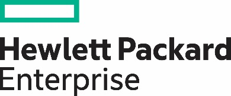
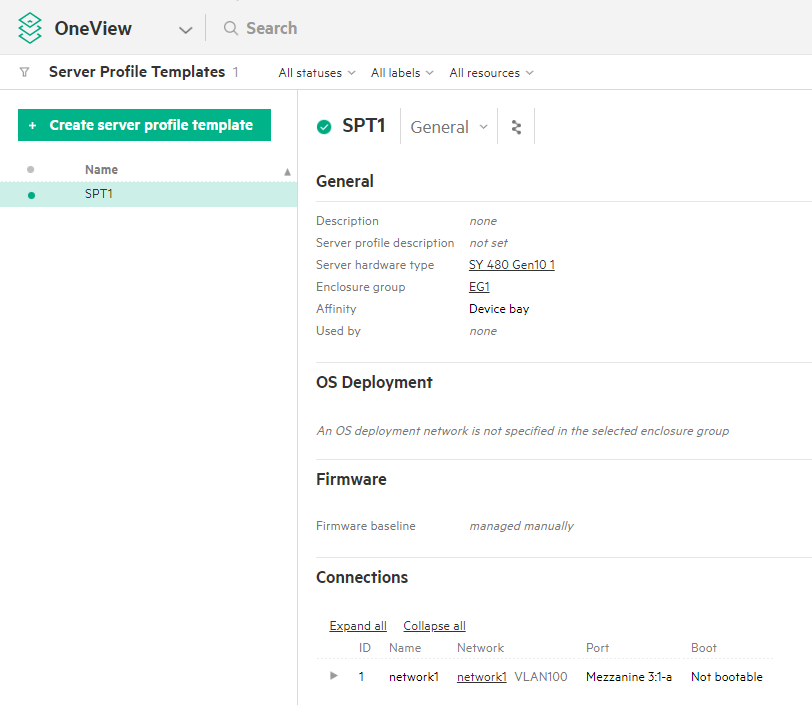
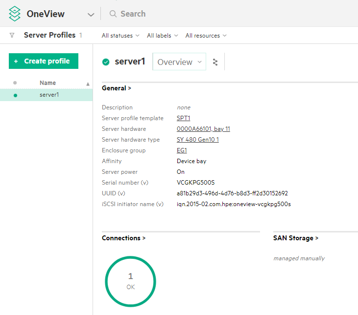

# Infrastructure as code with HPE OneView and Ansible by Red Hat

## Introduction

This document and accompanying [GitHub repository](https://github.com/HewlettPackard/oneview-ansible/blob/master/examples/infrastructure_as_code) are meant to assist customers and partners in provisioning physical infrastructure, under management by [HPE OneView](https://hpe.com/info/oneview), using [Ansible](https://www.ansible.com/) playbooks. These playbooks then can be checked into source control (eg. git) allowing you to treat infrastructure as code.

Benefits of this infrastructure as code approach include, complete datacenter automation, consistent reproducibility, versioning, and roll back.

## Setup

You will need the [HPE OneView  Ansible modules](https://github.com/HewlettPackard/oneview-ansible). See the README for installation instructions. The playbooks for this example can be found [here](https://github.com/HewlettPackard/oneview-ansible/blob/master/examples/infrastructure_as_code). Or, you can skip the installation and run the Ansible playbooks from a containerized version on the [Docker Store](https://store.docker.com/community/images/hewlettpackardenterprise/oneview-ansible-debian)

## HPE OneView essentials

HPE OneView provides software-defined resources, including templates, profiles, and groups that provide an innovative way to manage the entire data center. These logical constructs let an application or IT organization compose compute, networking, and storage into configurations that are specific to the desired workloads or applications.

Server profiles templates enable you to provision bare metal infrastructure quickly and consistently. Server Profile Templates can be used to
capture best practices once, and then roll them out multiple times in an efficient and error-free way.
A server profile template captures key aspects of a server configuration in one place, including:

* BIOS settings
* Boot order configuration
* Unique IDs such as MAC addresses
* Firmware update selection and scheduling
* OS deployment settings
* Local storage and SAN storage
* Local RAID configuration
* Network connectivity

## Infrastructure as code example

This example will configure a hardware server with boot settings and a network connection, then boot the server.

### Configuration

* Edit `oneview-config.json` and provide the IP address and credentials for the OneView appliance or Synergy Composer module.
* Edit `infrastructure-config.yml` Provide names for the server profile template and server profile that will be created. Provide the names of the enclosure group, hardware server type, hardware server, and network that will be provisioned. These names can be discovered via the OneView web interface.

### Create the server profile template

The playbook [`server_profile_template.yml`](https://github.com/HewlettPackard/oneview-ansible/blob/master/examples/infrastructure_as_code/server_profile_template.yml) will create the server profile template.

Run the command:

```bash
ansible-playbook server_profile_template.yml
```

After the server profile template is created, the playbook returns information about the created resource. You can also see the result of the template creation in OneView.

Server profile template



### Create and apply the server profile

Now that we have a server profile template, we can run [`server-profile.yml`](https://github.com/HewlettPackard/oneview-ansible/blob/master/examples/infrastructure_as_code/server_profile.yml) which will create a server profile and assign it to specific server which will configure the hardware. Then the playbook will boot the server.

```bash
ansible-playbook server_profile.yml
```

This playbook will also return a lot of information about the newly provisioned server. You can see the result of the server profile creation in OneView.

Server profile



### Clean up

[`clean.yml`](https://github.com/HewlettPackard/oneview-ansible/blob/master/examples/infrastructure_as_code/clean.yml) will power off the server, delete the server profile, and delete the server profile template, restoring the system to the state before the example.

### Conclusion

With a HPE OneView and a few Ansible playbooks, it is possible to easily provision physical infrastructure with complete automation and enjoy a more streamlined operational workflow in the datacenter.

## Resources, contacts, or additional links

* HPE GitHub organization - <https://github.com/HewlettPackard>
* HPE OneView Ansible modules - <https://github.com/HewlettPackard/oneview-ansible>
* HPE OneView Ansible samples - <https://github.com/HewlettPackard/oneview-ansible-samples>
* HPE OneView Developers Hub - <https://hpe.com/developers/oneview>
* HPE OneView documentation - <https://hpe.com/info/oneview/docs>

Learn more at <https://hpe.com/info/oneview>

Copyright (2020) Hewlett Packard Enterprise Development LP
